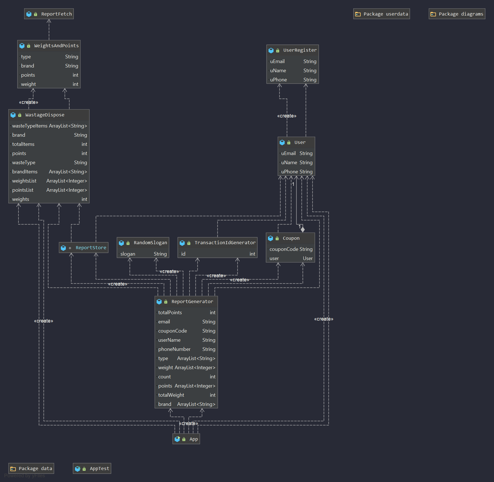
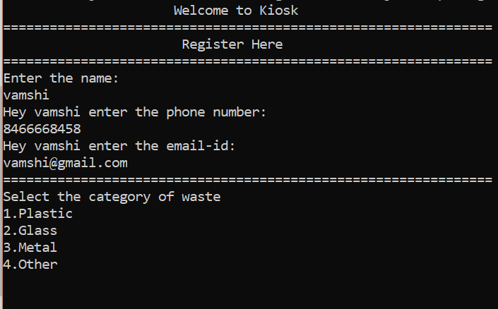
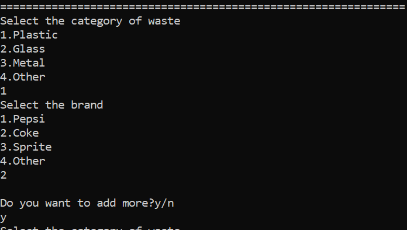
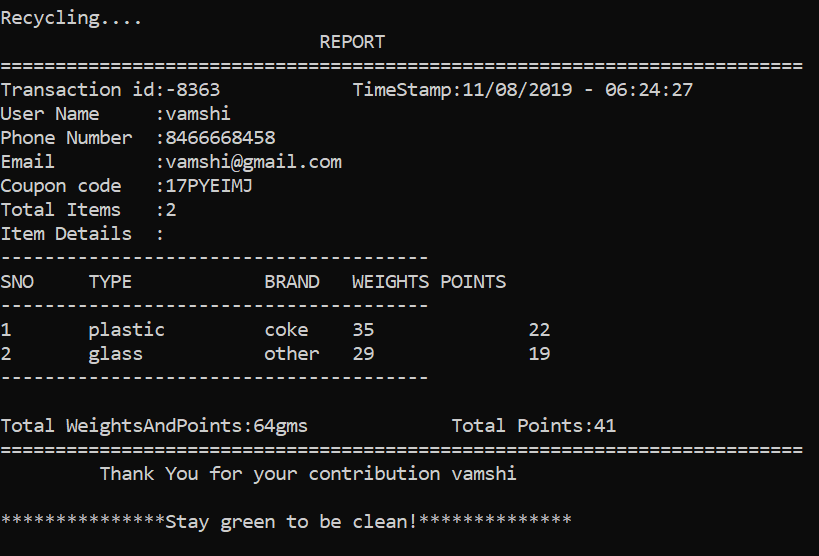

# Kiosk Project
## About the project
This project provide user with a platform to dispose waste (like plastic, metal tins, glass) and also the brand of the item. It generates a detailed report on the items disposed with their weights and points earned with unique coupon code and transaction id.   
## Installation
### Clone this repository
```
git clone https://github.com/vamshikrishnaginna/Swachh-Bharat-Assignment.git

```
### Running the project
* Clone this repository and extract the zip to a folder.
* Open the CMD/Terminal prompt, inside the folder.
* Enter below mentioned command to run the project.
```
java -cp target/SwachBharatFinal.jar com.rubiconred.swachhbharat.App

```

## Configuration
To run the project on your machine you need to have the following dependencies installed.

**Dependencies**
* **json-simple**: This dependency handles data that is to be written and fetch the data from JSON file.
* **gson**: Convert Java Objects into their JSON representation.
* **jackson-databind**: Convert JSON to and from POJO (Plain Old Java Object) using property accessor or using annotations. It is of two type. Simple Data Binding - Converts JSON to and from Java Maps, Lists, Strings, Numbers, Booleans and null objects.

**Plugins**
* maven-clean-plugin 
* maven-resources-plugin
* maven-compiler-plugin
* maven-surefire-plugin
* maven-jar-plugin
* maven-install-plugin
* maven-shade-plugin
* maven-project-info-reports-plugin
* maven-site-plugin
* maven-deploy-plugin

## Functionality
* Collecting user details
* Display list of item types and brands.
* Calculate points for a given item type and brand by taking weights from JSON file.
* Generate a unique transaction id for each transaction
* Print timestamp as part of output.
* Generate a compete report of the transactions like a bill
* Display a thank you statement.
* Print a random slogan from a set of slogans in a array list.
* Write the transaction details to JSON file.
 
## Assumptions
* points are generated based on the weights 
* There are only 4 types and 4 brand are available
* Weights are predefined and points are calculated based on weights
* No login is required. Just enter details and waste to generate coupon code.

## UML daigram 
 


## Final output




* User deatils are store in JSON file in src/main/java/com/rubiconred/swachhbharat/data/userdata/

